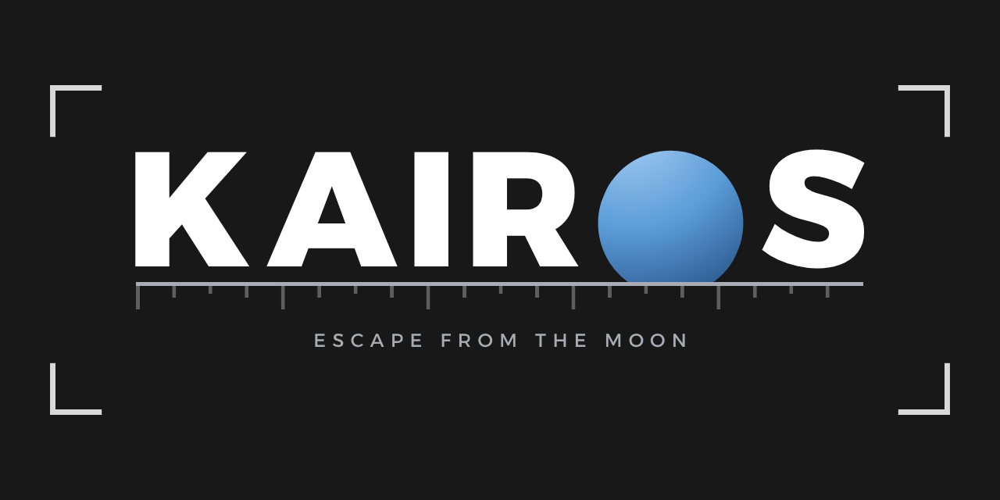

<p align="center">
  
</p>

Kairos est un jeu de survie 2D développé en Lua avec [LÖVE](https://love2d.org).

Vous êtes bloqué sur la Lune : récoltez des ressources, réparez votre fusée et décollez le plus vite possible — avant de manquer d'oxygène. Votre score est le temps passé sur place : le plus court est le meilleur.


# Installation

### Depuis une release (aucune dépendance à installer)

Rendez-vous sur la page [Releases](https://github.com/mabaehr06/kairos/releases) et téléchargez :

| Plateforme | Fichier | Utilisation |
|---|---|---|
| Windows | `Kairos-windows-x64.zip` | Dézippez **entièrement** le dossier, puis lancez `Kairos.exe` |
| Linux | `Kairos-linux-x86_64.AppImage` | `chmod +x Kairos-linux-x86_64.AppImage` puis double-clic |
| LÖVE déjà installé | `Kairos.love` | `love Kairos.love` |

Sur Windows, les DLL doivent rester à côté de l'exécutable : lancer le `.exe` directement depuis l'archive zip ne fonctionnera pas.

Sur Ubuntu 24.04 et plus récent, si l'AppImage refuse de démarrer avec une erreur `libfuse.so.2` :

```bash
sudo apt install libfuse2t64
```

### Depuis les sources

- [LÖVE 11.5](https://love2d.org)
- `love .` depuis la racine du projet

## Contrôles

| Touche | Action |
|---|---|
| Z Q S D | Déplacement |
| F | Récolter / interagir (fusée & objets) |
| E | Ouvrir l'inventaire |
| C | Consommer de la glace (+1 oxygène) |
| V | Consommer de l'oxygène pur (+5 oxygène) |
| Clic gauche (inventaire) | Lancer une fabrication |
| Clic droit (inventaire) | Sélectionner un objet à poser |
| Clic (carte) | Poser l'objet sélectionné |
| R | Recommencer une partie (en jeu) |
| Échap | Quitter |

## Architecture

Le projet sépare les **écrans** des **composants**. Un écran vit dans `src/scenes` : il possède son état, ses entrées et son dessin, et expose `enter`, `update`, `draw`, `keypressed` et `mousepressed`. Un composant vit dans `src/gui` : il ne connaît rien des états du jeu et se contente d'être réutilisé par les écrans.

`main.lua` ne fait que transmettre : une table associe chaque état du jeu à sa scène, et les quatre fonctions de LÖVE donnent la main à la scène courante.

```
main.lua              point d'entrée LÖVE, transmet tout à la scène de l'état courant
conf.lua              fenêtre et identité du jeu
src/
├── config.lua        toutes les constantes de gameplay
├── items.lua         ressources, objets et recettes
├── game.lua          machine à états, chronomètre, victoire / défaite
├── map.lua           génération de la carte et des ressources
├── player.lua        déplacement, inventaire, oxygène, interactions
├── rocket.lua        étapes de réparation et décollage
├── crafts.lua        file de fabrication et pose d'objets
├── power.lua         production et consommation d'électricité
├── cycle.lua         cycle jour / nuit
├── camera.lua        suivi du joueur, conversion écran ↔ monde
├── save.lua          persistance du meilleur temps
├── fonts.lua         polices du jeu, en tailles relatives à la fenêtre
├── version.lua       version du jeu, injectée depuis le tag git à la release
├── utils.lua         fonctions utilitaires
├── scenes/           les écrans : menu, partie et inventaire, écrans de fin
├── gui/              les composants : bouton, HUD, panneau d'inventaire
└── debug/log.lua     journal d'événements à l'écran
assets/               logo, bannière et polices
docs/                 documentation du projet
```

## Configuration

`src/config.lua` regroupe l'intégralité des valeurs de gameplay : vitesse du joueur, réserve d'oxygène, taille de la carte, densité des ressources, durée du cycle, rendement des panneaux. Aucune de ces valeurs n'est codée en dur ailleurs, c'est donc le seul fichier à toucher pour équilibrer le jeu.

L'interface se place en fractions de la taille de la fenêtre : le jeu suit n'importe quelle résolution, et le plein écran se règle dans `conf.lua`.

Le meilleur temps est stocké dans `best.txt`, dans le répertoire de sauvegarde LÖVE :

- Linux — `~/.local/share/love/kairos/`
- Windows — `%APPDATA%\LOVE\kairos\`

## Releases

Pousser un tag lance la construction des trois formats et publie la release :

```bash
git tag vX.X.X && git push --tags
```

Le nom du tag devient la version affichée dans le menu.

## Problèmes

Pour tout problème trouvé, merci d'ouvrir une [issue](https://github.com/mabaehr06/kairos/issues) avec le nom du problème ainsi qu'une description pour m'aider dans la résolution de l'erreur. Quelques exemples sont déjà affichés pour vous aider..

## Licence

Le code est sous licence MIT — voir [LICENSE](LICENSE).

La police [Alexandria](https://fonts.google.com/specimen/Alexandria) est distribuée sous SIL Open Font License 1.1, dont le texte accompagne le fichier dans [assets/fonts](assets/fonts).
